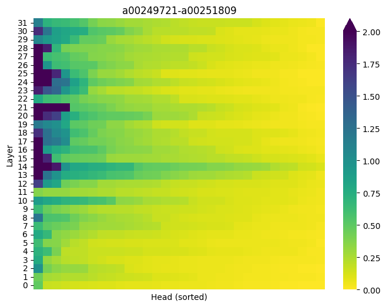

# AxesLens

Anonymous research materials accompanying the submission *AxesLens: Probing Concept
Representations in LLMs through Semantic Axes*.

## Overview


AxesLens recovers each semantic axis (a pair of antonymous WordNet synsets, e.g.
*cowardly* vs. *brave*) as a geometric axis in the attention heads of an LLM, and rates
concepts (e.g. social groups) by their projections onto it.

## Installation
```bash
pip install -r requirements.txt
```
## Recovered geometric axes

The geometric axes for all 1,999 WordNet semantic axes are available on Hugging Face:
https://huggingface.co/datasets/NsrxRwWa/AxesLens

Files: `<model>/<template>_n<n>/<level>_<position>.npz`
- model: `Meta-Llama-3-8B-Instruct` | `Mistral-7B-Instruct-v0.1` | `Qwen3-8B`
- template, n: `listing` | `simple`; `15` | `30` sentences per pole
- level, position: `head` | `layer`; `mean` (mean-over-tokens) | `last` (last-token)

Each file contains `axis_keys` (WordNet 3.0 IDs of the semantic axes), `scores` (variance
ratios) and `directions` (geometric axes).

<details>
<summary><b>Example: variance-ratio heatmap of one semantic axis</b></summary>

```python
import numpy as np, matplotlib.pyplot as plt, seaborn as sns
from huggingface_hub import hf_hub_download

path = hf_hub_download("NsrxRwWa/AxesLens",
                       "Meta-Llama-3-8B-Instruct/listing_n30/head_mean.npz",
                       repo_type="dataset")
d = np.load(path)
i = list(d["axis_keys"]).index("a00249721-a00251809")   # timid.a.01 - bold.a.01

S = np.sort(d["scores"][i], axis=1)[:, ::-1]            # heads sorted per layer
sns.heatmap(S[::-1], cmap="viridis_r", vmin=0, vmax=2.0, xticklabels=False,
            yticklabels=list(range(31, -1, -1)))        # layer 0 at the bottom
plt.xlabel("Head (sorted)"); plt.ylabel("Layer")
plt.title("timid.a.01 - bold.a.01")
plt.show()
```

<p align="center">
  
</p>

</details>

## Repository structure
- `scripts/`: pipeline for building the semantic axes, probing datasets and geometric axes
  (see `scripts/README.md`)
- `data/`: raw inputs and processed data (see `data/README.md`)
- `docs/`: overview figure and example heatmap
